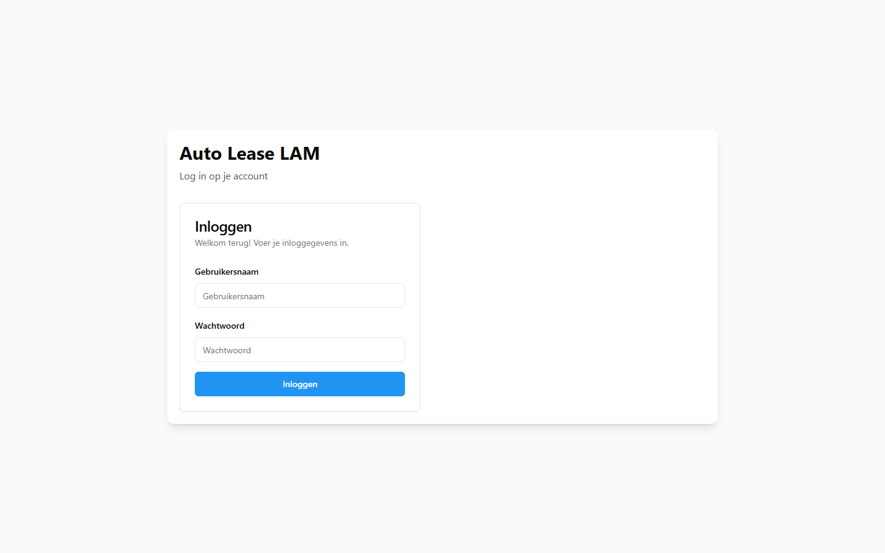

# 1. Snel aan de slag

Dit hoofdstuk brengt je in een half uur op gang: inloggen, het scherm lezen, iets terugvinden en
de handelingen doen die je de eerste week het vaakst nodig hebt.

---

## 1.1 Inloggen

1. Open de browser en ga naar het adres van Car Rental Manager. Je collega of de beheerder geeft
   je dat adres; zet het bij je favorieten.
2. Je ziet **Auto Lease LAM** met daaronder *Log in op je account* en het kaartje **Inloggen**.
3. Vul je **Gebruikersnaam** in.
4. Vul je **Wachtwoord** in.
5. Klik op **Inloggen**, of druk op Enter.

*Het inlogscherm: vul je gebruikersnaam en wachtwoord in en klik op **Inloggen**.*

Je komt binnen op het **Dashboard**.

**Let op — vijf pogingen.** Na vijf mislukte inlogpogingen binnen een kwartier blokkeert de app
je werkplek een kwartier lang. De melding die je dan krijgt is Engelse technische tekst:
*"Too many login attempts from this IP, please try again after 15 minutes."* Dat betekent
gewoon: wacht een kwartier, of vraag de beheerder om je wachtwoord opnieuw te zetten. Blijf niet
doorproberen, want elke poging telt mee.

**Je eigen wachtwoord wijzigen.** Klik rechtsboven op je naam → **Profiel** → tabblad
**Wachtwoord**. Vul **Huidig wachtwoord**, **Nieuw wachtwoord** en **Bevestig nieuw wachtwoord**
in en klik op **Wachtwoord wijzigen**. Een wachtwoord moet minimaal 6 tekens hebben.

---

## 1.2 Het hoofdscherm

Elk scherm heeft dezelfde opbouw.

**Links: het menu.** Bovenaan staat **Auto Lease LAM**, daaronder de menu-items. Hoeveel items je
ziet, hangt af van je rechten (hoofdstuk 15). Een beheerder ziet ze alle twaalf:

**Dashboard · Voertuigen · Scannen · Klanten · Klantenportaal · Reserveringen · Onderhoud ·
Kosten · Documenten · Transporten · Communicatie · Rapporten**

Staat er een rood bolletje met een getal achter **Klantenportaal**, dan zijn er zoveel
ongelezen portaalmeldingen.

**Bovenaan: de balk.** Van links naar rechts:

| Onderdeel | Waarvoor |
|---|---|
| De naam van het scherm | Waar je bent, bijvoorbeeld *Reserveringen* |
| De portaaltegel, bijvoorbeeld *2 nieuwe aanvragen · 7 meldingen · **Klantenportaal*** | Eén klik naar het klantenportaal; verschijnt alleen als er iets openstaat |
| Het zoekveld **Zoeken...** | Zoeken door het hele systeem, zie 1.3 |
| Het belletje met een getal | Het **Meldingencentrum** |
| Je initialen en je naam | Je eigen menu: **Profiel**, taal, **Uitloggen** |

**Midden: het scherm zelf.**

**Dialoogvensters.** Veel handelingen gebeuren in een venster dat over het scherm heen opent —
een klant bekijken, een voertuig ophalen, een document uploaden. Je onderliggende scherm blijft
staan. Sluit zo'n venster met **Sluiten**, **Annuleren**, het kruisje rechtsboven of met Esc.

---

## 1.3 Een klant, voertuig of reservering zoeken

Het zoekveld **Zoeken...** bovenaan doorzoekt alles tegelijk.

1. Klik in **Zoeken...**, of druk op `/` of `Ctrl+K`.
2. Typ minimaal **twee tekens**. De app wacht tot je klaar bent met typen en zoekt dan pas — dat
   is normaal, blijf niet drukken.
3. De resultaten verschijnen eronder in drie groepen: **Voertuigen**, **Klanten** en
   **Reserveringen**.
4. Klik op een resultaat. Het opent meteen in een venster over je huidige scherm heen.

Zijn er veel resultaten, klik dan op **Bekijk alle resultaten** of druk op Enter. Je krijgt een
groter venster: *Zoekresultaten voor "…"*.

**Wat je kunt intypen:**

| Je typt | Je vindt |
|---|---|
| Een kenteken, hele of halve, met of zonder streepjes | Het voertuig |
| Een naam of e-mailadres van een klant | De klant, en zijn reserveringen |
| Een contractnummer | De reservering; bij het resultaat staat dan *Contractnr. 0419* |
| Een merk of model | De voertuigen van dat merk |

Het contractnummer is het nummer dat een klant aan de telefoon voorleest. Dat je daarop kunt
zoeken, scheelt je het doorbladeren van de kalender.

**Een voertuig zoeken met de scanner.** Heb je het sleutellabel in je hand, dan is scannen
sneller dan typen: druk op `S`, of ga naar **Scannen**. Zie 1.4.

---

## 1.4 De taken die je het vaakst doet

**Wat er vandaag meegaat en terugkomt,** zie je in de kalender onder **Reserveringen**: in het
vakje van vandaag staat per auto het kenteken met **uit** (gaat vandaag mee) of **in** (komt
vandaag terug), en de klant. Zie hoofdstuk 5, paragraaf 5.1.

### Een auto meegeven (ophalen)

1. Klik op het **Dashboard** onder **Snelle acties** op **Ophalen starten**.
2. Scan het sleutellabel of typ het kenteken. Hoort er bij die auto een ophaling, dan opent
   meteen het venster **Ophaalproces starten**. (Zonder sleutel in je hand kan het ook zo: open
   de reservering in de kalender en klik op **Ophalen starten**.)
3. Opent het venster niet, dan staat er voor deze auto geen ophaling klaar en zie je alleen de
   gegevens van de auto. Controleer dan het kenteken en de reservering.
4. Controleer bovenin **Kenteken**, **Voertuig** en **Klant**. Is dit niet de juiste regel,
   klik dan op **Annuleren**.
5. **Contractnummer** is al ingevuld. Laat het staan, tenzij er een reden is om het te wijzigen.
6. **Ophaaldatum** staat op vandaag.
7. Vul **Kilometerstand bij ophalen** in. In het veld zie je wat de app als laatste stand kent,
   bijvoorbeeld *Huidig: 42.391 km*.
8. Zet **Brandstofniveau bij ophalen** op de juiste waarde: **Vol**, **3/4**, **1/2**, **1/4**
   of **Leeg**.
9. Maak eventueel een schadecheck: **Ophaal-schadecheck aanmaken** voor de digitale check, of
   **Papieren check uploaden** als je een formulier op papier hebt.
10. Klik op **Ophalen voltooien & contract genereren**.

Je krijgt de melding *Ophalen voltooid — Voertuig succesvol opgehaald. Contract is gegenereerd.*

**Drie dingen die de app kan vragen:**

- *De huur start eerder — datum aanpassen?* Je haalt de auto op vóór de afgesproken startdatum.
  Antwoord **Ja, startdatum naar vandaag** als de huur vandaag ingaat: dan kloppen de periode en
  de prijs. Antwoord **Nee, niet ophalen** als de klant de auto nog niet meekrijgt; er wordt dan
  niets opgeslagen.
- *Dubbel contractnummer.* Het nummer is al in gebruik. De app laat zien bij welke reservering.
  Ga alleen door met **Overschrijven & doorgaan** als je zeker weet dat je een fout herstelt —
  de andere reservering raakt dan haar contractnummer kwijt.
- *Kilometerstand-overschrijving vereist.* De stand die je invult is lager dan wat de app van
  deze auto weet. Kijk eerst of je je verkeken hebt. Klopt jouw stand echt, dan moet iemand met
  het recht **Kilometerverlaging goedkeuren** het bevestigen met **zijn eigen**
  accountwachtwoord. Heb jij dat recht niet, dan meldt de app dat en haal je er een collega bij.

### Een auto terugnemen (innemen)

1. Klik op het **Dashboard** onder **Snelle acties** op **Innemen starten**.
2. Scan het sleutellabel of typ het kenteken. Staat de auto als opgehaald, dan opent meteen het
   venster **Inleverproces starten**. (Of: open de reservering in de kalender en klik op
   **Inleveren starten**.)
3. Opent het venster niet, dan staat deze auto niet als opgehaald en zie je alleen de gegevens
   van de auto. Controleer dan het kenteken en de reservering.
4. Vul **Kilometerstand bij inleveren** in. Die mag niet lager zijn dan bij het ophalen. Is hij
   dat wel, dan weigert de app met *"Kilometerstand bij inleveren kan niet lager zijn dan bij
   ophalen (… km)."* Lees de teller dan opnieuw af.
5. Zet **Brandstofniveau bij inleveren**.
6. Maak eventueel **Inlever-schadecheck aanmaken**, of upload een **Papieren check**.
7. Zet bijzonderheden (schade, ontbrekende sleutel, vuil) in **Aanvullende notities**.
8. Klik op **Inleveren voltooien & schadecheck genereren**.

**Belangrijk:** met het innemen is de huur meteen afgesloten en staat de auto weer vrij. Je hoeft
daarna niets meer op een status te zetten. De afgesproken einddatum blijft staan zoals hij was;
de werkelijke inleverdatum wordt apart vastgelegd.

### Een nieuwe klant aanmaken

1. Klik links op **Klanten**.
2. Klik rechtsboven op **Klant toevoegen**.
3. Vul op het tabblad **Basisgegevens** minimaal de naam in. Kies bij **Klanttype** tussen
   **Zakelijk** en **Particulier**.
4. Vul op **Contact** het e-mailadres en telefoonnummer in. Doe dit meteen: zonder e-mailadres
   kun je de klant later geen contract of herinnering sturen.
5. Vul bij een bedrijf ook het tabblad **Bedrijf** in.
6. Klik onderaan op **Klant toevoegen**.

### Een nieuwe reservering maken

1. Druk op `N`, of klik op **Reserveringen** → **Nieuwe reservering**.
2. **1. Selecteer huurdata** — vul **Startdatum** en **Einddatum** in. Weet je de inleverdatum
   nog niet, zet dan **Huur zonder einddatum** aan. Vul de datums éérst: daarna toont de app
   alleen voertuigen die in die periode vrij zijn.
3. **2. Selecteer voertuig en klant** — kies het **Voertuig** en de **Klant**. Beide velden
   zoeken mee terwijl je typt. Eventueel kies je een **Gemachtigde chauffeur**.
4. **3. Reserveringsdetails** — laat **Reserveringsstatus** op **Geboekt** staan. De
   **Totaalprijs (€)** vult de app zelf in op basis van het dagtarief maal het aantal dagen; typ
   je er zelf iets in, dan blijft jouw bedrag staan.
5. Klik op **Reservering aanmaken**.

Twee dingen die je kunt tegenkomen:

- Een gele balk *"Let op: dit voertuig staat in deze periode ingepland voor onderhoud (… t/m …).
  Opslaan mag; het onderhoudsblok blijft staan."* Je mag doorgaan, maar weet dan dat de auto in
  die periode ook door de werkplaats geclaimd is.
- Een rode balk dat het voertuig al gereserveerd is. Dan is opslaan geblokkeerd; kies een andere
  auto of andere datums.

### Een voertuig opzoeken en bekijken

1. Klik links op **Voertuigen**, of typ het kenteken in het zoekveld bovenaan.
2. Klik bij de juiste regel op **Bekijken**.
3. Je ziet **Voertuiggegevens** met de tabbladen **Algemeen**, **Kosten**, **Documenten**,
   **Reserveringen**, **Onderhoud** en **Geschiedenis**.
4. Sluit met **Sluiten** of **Terug**.

### Een reservering opzoeken

1. Typ het kenteken, de klantnaam of het contractnummer in het zoekveld bovenaan.
2. Klik onder **Reserveringen** op de juiste regel. Je ziet **Reserveringsdetails** met de
   periode, het voertuig, de klant, de documenten en de geschiedenis.

Of: **Reserveringen** → zoek de dag in de kalender → klik op de regel. Op een kalenderdag staat
achter elk kenteken **uit** (die dag opgehaald) of **in** (die dag terug).

---

## 1.5 Uitloggen

1. Klik rechtsboven op je naam.
2. Klik op **Uitloggen**.

Log uit als je de werkplek verlaat. Doe je dat niet, dan komt na veertien minuten zonder
handelingen het venster **Sessie verloopt binnenkort** met een aftelling. Kies **Ingelogd
blijven** om door te werken, of **Nu uitloggen**. Doe je niets, dan meldt de app *Sessie
verlopen — Je bent uitgelogd wegens inactiviteit* en moet je opnieuw inloggen. Werk dat nog niet
opgeslagen is, ben je dan kwijt: sla een formulier af voordat je wegloopt.

---

## 1.6 Wat je in de eerste week beter niet doet

| Niet doen | Waarom |
|---|---|
| Een klant of voertuig verwijderen | Er hangen reserveringen, documenten en kosten aan. Vraag het eerst na. |
| Een contractnummer overschrijven | De andere reservering raakt haar nummer kwijt. |
| Een bestaande reservering "even" op een andere status zetten | Ophalen en innemen doe je met de knoppen **Ophalen starten** en **Innemen starten**, niet met het statuslijstje. |
| Vanuit de app een back-up terugzetten | Dat overschrijft alle gegevens. Alleen de beheerder. |

Zie verder hoofdstuk 11, veelgemaakte fouten.
