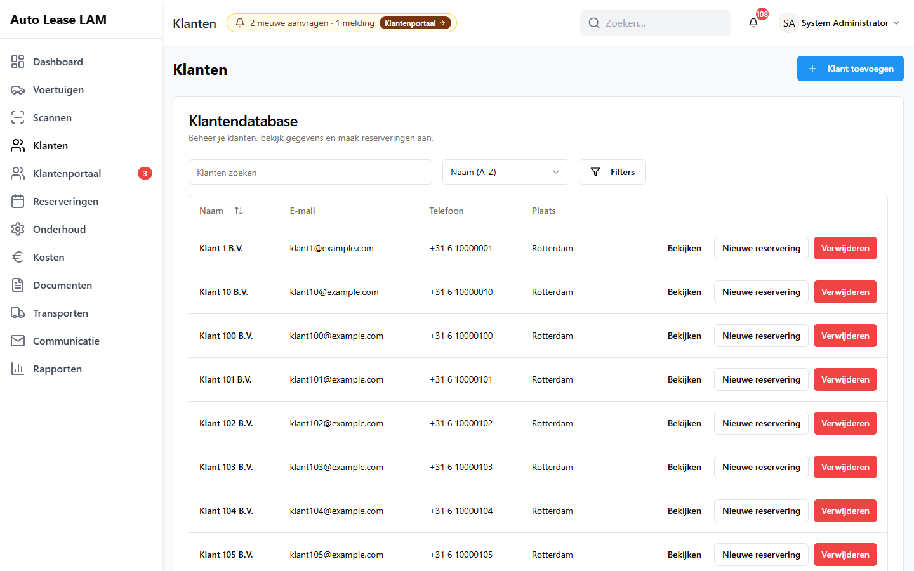

# 3. Klanten

Alles wat je met een klant doet, gebeurt op het scherm **Klanten**: opzoeken, aanmaken,
bijwerken, chauffeurs bijhouden, een portaalaccount regelen en — als het echt moet — verwijderen.

Een klant is de partij die de auto huurt. Dat is meestal een bedrijf. De persoon die achter het
stuur zit, is de **chauffeur**; die leg je apart vast bij de klant (3.6). Dat onderscheid is
belangrijk: het contract gaat naar de klant, het rijbewijs hoort bij de chauffeur.

---

## 3.1 Een klant opzoeken

1. Klik links op **Klanten**. Je komt op de **Klantendatabase**.
2. Typ in het veld **Klanten zoeken** een deel van de naam, het e-mailadres of de plaats. De
   lijst filtert zichzelf terwijl je typt.
3. Sorteer eventueel met het keuzelijstje ernaast: **Naam (A-Z)**, **Naam (Z-A)**, **Nieuwste
   eerst**, **Oudste eerst**, **Meeste verhuur**, **Recente activiteit** of **Actieve verhuur**.
4. Wil je alleen een bepaald soort klanten zien, klik dan op **Filters**. Je krijgt het vakje
   **Klanten filteren** met onder andere **Recente klanten (30 dagen)**, **Frequente klanten
   (3+ reserveringen)**, **Volledig profiel**, **Onvolledig profiel**, **Actieve verhuur**,
   **Heeft chauffeurs**, **Zakelijk** en **Particulier**. Met **Filters wissen** zet je ze weer
   uit.

De tabel heeft de kolommen **Naam**, **E-mail**, **Telefoon** en **Plaats**. Achter elke regel
staan **Bekijken**, **Nieuwe reservering** en **Verwijderen**. Een leeg veld toont een streepje.
Staat er onder het e-mailadres een blauw label **Portaal (1)**, dan heeft deze klant zoveel
portaalaccounts (3.7).

Onderaan staat hoeveel regels je ziet, bijvoorbeeld *1-10 van 300 getoond*, met **Vorige** en
**Volgende**.

*De **Klantendatabase**: zoekveld, sorteerkeuze en **Filters** boven de lijst; achter elke regel
**Bekijken**, **Nieuwe reservering** en **Verwijderen**.*

**Sneller:** het zoekveld bovenin het scherm (hoofdstuk 1, paragraaf 1.3) doorzoekt klanten,
voertuigen en reserveringen tegelijk. Zoek je alleen een klant, dan is de klantenlijst
overzichtelijker.

---

## 3.2 Een klant bekijken

Klik bij de juiste regel op **Bekijken**. Je krijgt het venster **Klantgegevens** met als
ondertitel *Bekijk klantinformatie en reserveringsgeschiedenis*.

Bovenin staan de naam, de regel *Klant sinds <datum>* en de knoppen **Terug**, **Bewerken** en
**Nieuwe reservering**. Daaronder vier tegels: **Totaal aantal verhuringen**, **Actieve
verhuringen**, **Voltooid** en **Totaal aantal km gereden**.

Daaronder staan vijf tabbladen:

| Tabblad | Wat je er ziet |
|---|---|
| **Persoonlijke gegevens** | Alle vastgelegde gegevens: persoonlijke informatie, contactgegevens, adres, bedrijfsgegevens en de recordgegevens (wie het aanmaakte en wanneer) |
| **Chauffeurs** | De bevoegde chauffeurs van deze klant, zie 3.6 |
| **Actieve verhuringen** | Wat er nu loopt |
| **Geschiedenis** | De afgeronde verhuringen, met **Exporteren (CSV)** |
| **Portaal** | Het klantenportaal van deze klant, zie 3.7 |

Wat niet is ingevuld, staat er als **Niet opgegeven**. Dat is geen fout; het betekent gewoon dat
het veld leeg is. Vul het aan zodra je het weet: wat leeg is op de klantkaart, blijft ook leeg op
het contract (hoofdstuk 8).

Onderaan het tabblad **Persoonlijke gegevens** staat het blok **Geblokkeerde voertuigen** —
*Voertuigen die deze klant niet mag huren*. Staat daar *Deze klant is niet geblokkeerd voor enig
voertuig*, dan mag de klant alles huren.

Sluit het venster met **Sluiten** of **Terug**.

---

## 3.3 Een nieuwe klant aanmaken

1. Klik links op **Klanten**.
2. Klik rechtsboven op **Klant toevoegen**. Het venster **Nieuwe klant toevoegen** opent.
3. Vul het tabblad **Basisgegevens** in:
   - **Klanttype** — kies **Zakelijk** of **Particulier**. Standaard staat hij op **Zakelijk**.
   - **Debiteurnummer** — het nummer waarop de boekhouding deze klant kent.
   - **Volledige naam** — het enige veld dat écht verplicht is.
   - **Voornaam**, **Achternaam**, **Naam chauffeur**, **Rijbewijsnummer**.
   - Onder **Adresgegevens**: **Straatnaam**, **Straatadres**, **Postcode**, **Plaats** en
     **Land** (staat al op *Nederland*).
4. Ga naar het tabblad **Contact** en vul minstens **Primair e-mailadres** en **Primair
   telefoonnummer** in. Doe dit meteen: zonder e-mailadres kun je deze klant later geen contract
   en geen herinnering sturen. Verder kun je hier een apart **E-mailadres voor APK-keuring**,
   **E-mailadres voor facturen**, **Algemeen e-mailadres** en **Telefoonnummer chauffeur**
   kwijt.
5. Is het een bedrijf, vul dan het tabblad **Bedrijf** in: **Bedrijfsnaam**, **Contactpersoon**,
   **Kamer van Koophandel nummer (KvK)**, **BTW-nummer**, **RSIN**, het **Facturatiecontact**,
   de **Accountmanager**, de **Zakelijke korting (%)** en zo nodig een afwijkend
   **Facturatieadres**.
6. Het tabblad **Aanvullend** is voor **Status**, **Statusdatum** en **Notities**.
7. Klik onderaan op **Klant toevoegen**.

Je krijgt de melding **Klant succesvol aangemaakt** — *De klant is toegevoegd aan je systeem.*

**Twee dingen om te weten:**

- De app zet de naam om naar normale schrijfwijze met hoofdletters per woord. Typ je
  *HANDLEIDING-KLANT BV*, dan staat er daarna *Handleiding-klant Bv*. Wil je de exacte
  schrijfwijze van een bedrijfsnaam bewaren, zet die dan ook in **Bedrijfsnaam** op het tabblad
  **Bedrijf**.
- Vul je de naam niet of te kort in, dan verschijnt onder het veld de Engelse melding
  *"Name must be at least 2 characters."* Dat betekent: de naam moet minstens twee tekens
  hebben.

---

## 3.4 De waarschuwing "Deze klant bestaat mogelijk al"

Zodra je op het tabblad **Contact** een e-mailadres of telefoonnummer intypt dat al bij een
andere klant staat, verschijnt er direct onder dat veld een oranje kader:

> **Deze klant bestaat mogelijk al**
> *<naam> — zelfde e-mailadres*
> *Je kunt gewoon doorgaan; dit is een waarschuwing, geen blokkade.*

Staat de klant er al op met **zelfde telefoonnummer** of met **zelfde e-mailadres +
telefoonnummer**, dan zie je dat er ook bij.

**Wat je doet:** klik op **Openen** naast de naam. Je opent dan de klant die er al is. Gebruik
die, en sluit het formulier dat je aan het invullen was.

De app blokkeert niet, en dat is met opzet: twee chauffeurs van hetzelfde bedrijf mogen best
hetzelfde telefoonnummer hebben. Maar één klant twee keer in het systeem betekent dat zijn huren
over twee kaarten verdeeld raken en dat je zijn geschiedenis nooit meer in één keer ziet. Neem
de waarschuwing dus serieus.

De waarschuwing verschijnt pas als het e-mailadres een `@` bevat of het telefoonnummer minstens
acht cijfers heeft, en met een kleine vertraging. Dat is normaal.

---

## 3.5 Een klant bijwerken

1. Open de klant met **Bekijken** en klik op **Bewerken**, of gebruik het potloodje in de lijst.
2. Het venster **Klant bewerken** opent — *Werk klantinformatie en gegevens bij*. Het is
   hetzelfde formulier als bij het aanmaken, met dezelfde vier tabbladen.
3. Wijzig wat nodig is en klik onderaan op **Klant bijwerken**.

Je krijgt **Klant succesvol bijgewerkt** — *De klant is bijgewerkt in je systeem.*

Wat je verandert, staat daarna in de geschiedenis van de klant: wie het deed, wanneer, en wat de
oude en nieuwe waarde waren.

> **Let op:** een lopend contract verandert niet mee. Wijzig je het adres of de naam van een
> klant nadat het contract gemaakt is, genereer het contract dan opnieuw (hoofdstuk 8).

---

## 3.6 Chauffeurs

Een chauffeur is de persoon die namens de klant mag rijden. Je koppelt hem aan de klant, en bij
het maken van een reservering kun je hem als **Gemachtigde chauffeur** aanwijzen (hoofdstuk 5).
Zo weet je achteraf wie de auto werkelijk had.

**Een chauffeur toevoegen**

1. Open de klant met **Bekijken**.
2. Klik op het tabblad **Chauffeurs**. Je ziet het kaartje **Bevoegde chauffeurs** — *Beheer
   chauffeurs die voertuigen mogen huren voor deze klant*.
3. Klik rechtsboven in dat kaartje op **Chauffeur toevoegen**.
4. Vul in het venster **Chauffeur toevoegen** minstens **Weergavenaam** in; dat is het enige
   verplichte veld (er staat een sterretje bij). Verder kun je kwijt: **Voornaam**,
   **Achternaam**, **E-mailadres**, **Telefoonnummer**, **Rijbewijsnummer**, **Land van afgifte
   rijbewijs**, **Vervaldatum rijbewijs**, een **Kopie rijbewijs (optioneel)** (JPG, PNG of PDF,
   maximaal 10 MB), **Voorkeurstaal**, **Status** (**Actief** of **Inactief**) en **Notities**.
5. Is dit de vaste bestuurder van deze klant, zet dan **Hoofdchauffeur** aan.
6. Klik op **Chauffeur toevoegen**.

Je krijgt **Chauffeur toegevoegd** — *De chauffeur is succesvol toegevoegd.*

Vul de **Vervaldatum rijbewijs** in als je hem weet. In de lijst krijgt de chauffeur dan het
label **Verloopt: <datum>**, en na die datum **Verlopen**. Dat is het enige plekje waar je ziet
dat een rijbewijs afloopt.

**Een chauffeur bekijken, wijzigen of verwijderen.** In de lijst staan per regel de kolommen
**Chauffeur**, **Contact**, **Rijbewijs**, **Voertuig**, **Status** en **Acties**, met de knoppen
**Bekijken**, **Bewerken** en **Verwijderen**. De hoofdchauffeur heeft het label **Hoofd**; een
chauffeur met een eigen portaallogin het label **Portaalaccount**.

Bij **Verwijderen** vraagt de app: *"Weet je zeker dat je <naam> wilt verwijderen? Deze actie kan
niet ongedaan worden gemaakt."* Een chauffeur gaat **niet** naar de prullenbak — die is dus echt
weg. Twijfel je, zet hem dan op **Inactief** in plaats van hem te verwijderen.

Staan er veel chauffeurs, gebruik dan het zoekveld *Zoek chauffeurs op naam, e-mail, telefoon of
rijbewijs...* boven de lijst.

---

## 3.7 Het portaalaccount van een klant

Via het klantenportaal kan een klant zelf online meekijken en aanvragen doen. Je regelt dat per
klant op het tabblad **Portaal**.

Het tabblad bestaat van boven naar beneden uit: **Portaalaccounts**, **Instellingen voor deze
klant**, **Aanvragen**, **Bekeuringen** en **Activiteit in het portaal**.

### Iemand uitnodigen

1. Open de klant met **Bekijken** en ga naar het tabblad **Portaal**.
2. Staat er nog niets, dan lees je *Nog geen accounts. Nodig een contactpersoon uit.*
3. Klik op **Uitnodigen**. Het venster **Portaalaccount** opent.
4. **E-mailadres** is alvast ingevuld vanuit de klantgegevens — er staat bij: *Vooraf ingevuld
   vanuit de klantgegevens; aanpassen mag.* Controleer het adres, want de uitnodiging gaat
   daarheen.
5. Vul de **Naam** in en kies de **Rol**: **Beheerder** (mag alles wat de klant mag) of
   **Bestuurder** (één chauffeur). Kies je **Bestuurder**, dan moet je ook een **Gekoppelde
   bestuurder** aanwijzen.
6. Onder **Rechten voor dit account** kun je per onderdeel een vinkje weghalen. Er staat bij:
   *Uitvinken haalt een onderdeel weg voor dit account. De instellingen van de klant blijven de
   bovengrens.* Je kunt dus nooit méér geven dan de klant zelf mag (zie hieronder).
7. Klik op **Uitnodigen**.

De klant krijgt een uitnodiging per e-mail. In de tabel staat de regel daarna met status
**Uitnodiging open**.

### De accountlijst lezen

De tabel heeft de kolommen **Naam**, **E-mail**, **Rol**, **Status** en **Laatste login**. De
statussen die je tegenkomt:

| Status | Betekenis |
|---|---|
| **Uitnodiging open** | De uitnodiging is verstuurd, de klant heeft nog niets gedaan |
| **Niet geactiveerd** | Er is een account, maar het is nog nooit gebruikt |
| **Actief** | De klant kan inloggen |
| **Geblokkeerd** | Het account is dichtgezet |

Achter een regel zit een menuutje met **Bewerken en rechten**, **Uitnodiging opnieuw sturen**
(alleen zolang het account niet geactiveerd is), **Wachtwoord-reset sturen** (alleen als het wél
geactiveerd is), **Blokkeren** / **Deblokkeren** en **Verwijderen** (alleen bij een
niet-geactiveerd account).

Met **Alles bekijken en zoeken** open je de volledige accountlijst van alle klanten.

### Wat deze klant online mag

Onder **Instellingen voor deze klant** zet je per onderdeel een schakelaar aan of uit:

**Portaal actief · Mag online huren (aanvraag) · Mag bestuurders beheren · Mag aanvragen
indienen · Mag eerder inleveren (terugbrengen) aanvragen · Ziet bekeuringen · Ziet contracten en
schadeformulieren · Ziet prijzen**

Daaronder is ruimte voor **Interne notities (wat heeft deze klant nodig?)**. Klik op **Opslaan**;
je krijgt *Instellingen opgeslagen.*

Deze instellingen zijn de bovengrens. Staat **Ziet prijzen** hier uit, dan ziet geen enkel
account van deze klant prijzen, ook niet als dat vinkje bij het account zelf aan staat.

### Aanvragen, bekeuringen en activiteit

Onder het accountblok staan drie overzichtjes: **Aanvragen** (wat deze klant online heeft
gevraagd), **Bekeuringen** en **Activiteit in het portaal**. Ze tonen alleen de laatste regels;
met **Alles bekijken en zoeken** ga je naar het volledige overzicht op het scherm
**Klantenportaal**.

Het afhandelen van aanvragen doe je niet hier, maar op het scherm **Klantenportaal** of op
**Vandaag**. Een onderhoudsaanvraag staat in hoofdstuk 7.

---

## 3.8 Een klant verwijderen

Verwijder een klant alleen als hij er echt niet hoort te staan — bijvoorbeeld een dubbel
aangemaakte kaart. Een klant met geschiedenis laat je staan.

1. Klik in de klantenlijst bij de juiste regel op **Verwijderen**.
2. Je krijgt het venster **Klant verwijderen**. Daarin staat eerst *Dit verwijdert ook:* met de
   lijst van wat er aan deze klant hangt — bijvoorbeeld *6 reserveringen*, *1 chauffeurs*,
   *1 portaalinstellingen*. Hangt er niets aan, dan staat er *Er is niets anders aan deze klant
   gekoppeld.*
3. Eronder staat *Een beheerder kan de klant daarna terugzetten vanuit de prullenbak.*
4. Typ de naam van de klant over in het veld **Typ <naam> om te bevestigen**. Zolang die niet
   klopt, blijft **Klant verwijderen** uitgeschakeld. Hoofdletters en extra spaties maken niet uit.
5. Klik op **Klant verwijderen**, of op **Annuleren** als je twijfelt.

**De app weigert als er nog een huur aan hangt.** Heeft de klant een lopende of toekomstige
reservering, dan zie je dat meteen bovenin het venster, in het rood:

> *Verwijderen kan niet: deze klant heeft een lopende of toekomstige reservering.*
> *Reservering #3370 — 13-09-2026 t/m 16-09-2026 (Geboekt)*
> *Rond die reservering af of annuleer hem eerst; daarna kan de klant naar de prullenbak.*

De knop **Klant verwijderen** blijft dan uit, ook als je de naam correct overtypt — je hoeft dus
niet eerst te klikken om de weigering te zien. Sluit het venster met **Annuleren**, rond eerst de
huur af of annuleer hem (5.9), en probeer het daarna opnieuw. Dat is met opzet: een klant
weghalen onder een lopende huur zou het contract en de factuur losmaken van de persoon die de
auto heeft.

**Terugzetten kan.** Een verwijderde klant komt in de prullenbak terecht. Een beheerder zet hem
terug via **Voertuigen** → **Verwijderde voertuigen**; die knop toont alle verwijderde records,
ook klanten, reserveringen en transporten (zie 4.12).

**Een dubbele klant opruimen doe je zo:**

1. Zet de reserveringen van de dubbele kaart over met **Klant wijzigen** op de reservering
   (hoofdstuk 5, paragraaf 5.5).
2. Verwijder daarna de lege dubbele kaart.

---

## 3.9 Snel naslaan

| Wat je wilt | Waar |
|---|---|
| Een klant zoeken | **Klanten** → **Klanten zoeken**, of het zoekveld bovenin |
| Een klant aanmaken | **Klanten** → **Klant toevoegen** |
| Een klant wijzigen | **Bekijken** → **Bewerken** |
| Meteen boeken voor deze klant | **Nieuwe reservering** in de lijst of in het klantvenster |
| Een chauffeur toevoegen | **Bekijken** → **Chauffeurs** → **Chauffeur toevoegen** |
| Een portaallogin regelen | **Bekijken** → **Portaal** → **Uitnodigen** |
| Zien wat een klant online mag | **Bekijken** → **Portaal** → **Instellingen voor deze klant** |
| Een klant verwijderen | **Verwijderen** in de lijst (lukt niet bij een lopende huur) |
| Een verwijderde klant terughalen | Beheerder: **Voertuigen** → **Verwijderde voertuigen** |
