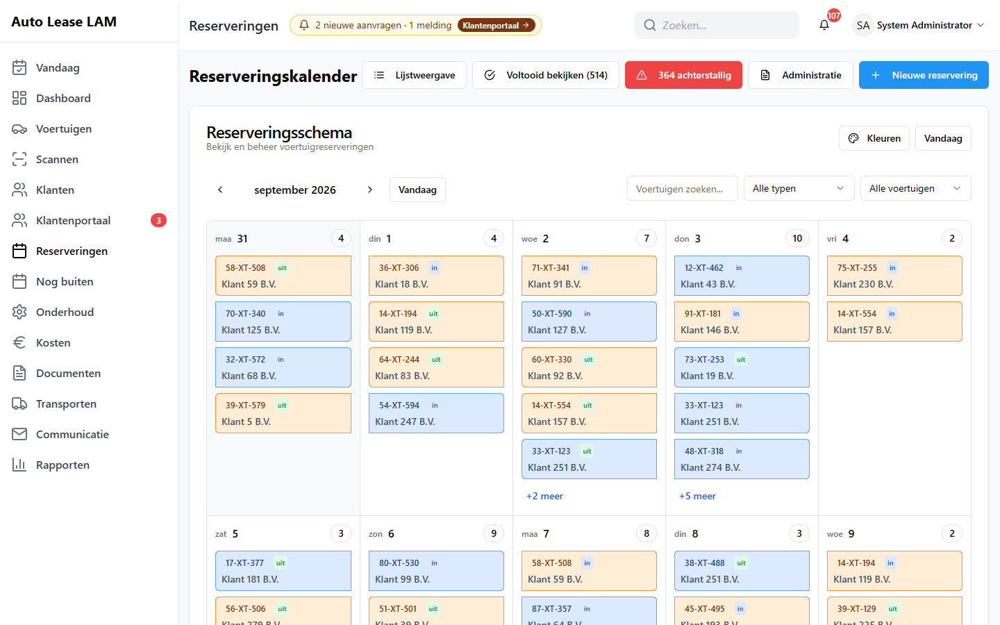
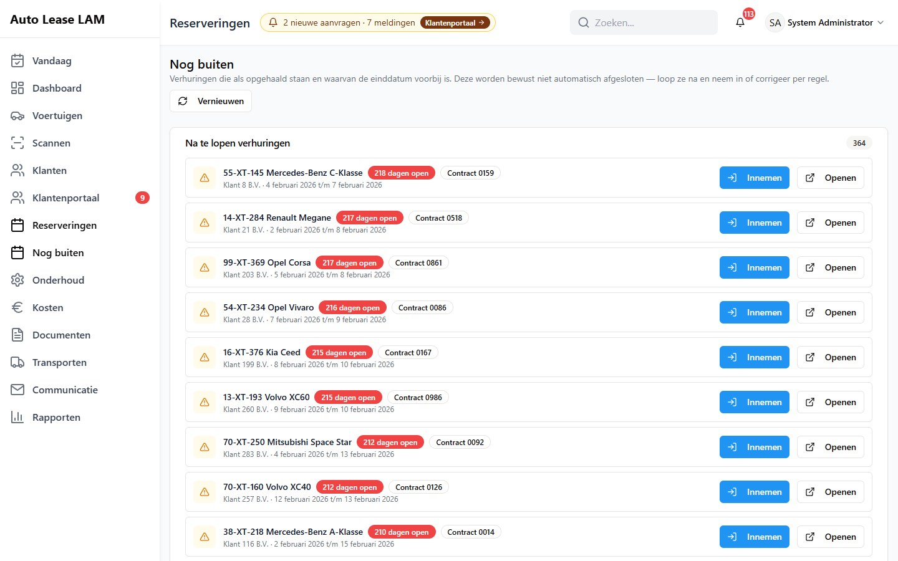

# 5. Reserveringen

Dit is het hart van de app. Een reservering koppelt één auto aan één klant voor een periode. Alles
wat daarna gebeurt — het contract, de kilometers, de schadecheck, de factuurgegevens — hangt aan
die ene regel.

De levensloop van een verhuring is kort:

**Geboekt** → *ophalen* → **Opgehaald** → *innemen* → **Voltooid**

Je zet die stappen met de knoppen **Ophalen starten** en **Inleveren starten**, nooit met het
statuslijstje. De knoppen leggen namelijk ook de kilometerstand, de brandstof en het
contractnummer vast, en maken het contract en de schadecheck aan.

---

## 5.1 De kalender

Klik links op **Reserveringen**. Je komt op de **Reserveringskalender** met standaard een
maandweergave.

Rechtsboven staan:

| Knop | Waarvoor |
|---|---|
| **Lijstweergave** | Dezelfde reserveringen als lijst, zie 5.2 |
| **Voltooid bekijken (…)** | De afgesloten verhuringen opzoeken en inzien, zie 5.8 |
| **… achterstallig** | De verhuringen die over hun einddatum heen zijn (rood) |
| **Administratie** | De factuurgegevens voor het externe facturatiesysteem |
| **Nieuwe reservering** | Een nieuwe boeking, zie 5.3 |

Boven de kalender zelf: **Kleuren** (de legenda), **Vandaag** (spring terug naar deze maand), de
pijltjes voor de vorige en volgende maand, en de filters **Voertuigen zoeken...**,
**Voertuigtype** (**Alle typen**) en **Beschikbaarheid** (**Alle voertuigen**, **Beschikbaar**,
**Gereserveerd**).

**Wat er in een dagvakje staat.** Alleen reserveringen die op die dag **beginnen of eindigen**.
Per regel zie je het kenteken, het woordje **uit** (die dag gaat de auto mee) of **in** (die dag
komt hij terug), en de klantnaam. Zijn er meer dan vijf, dan verschijnt **+… meer**; die knop
opent het venster **Reserveringen voor <datum>**.

Verder kun je in een dagvakje tegenkomen:

- een moersleuteltje bij een onderhoudsblok, met de tekst *Onderhoud: <type> - <status>*;
- **TBD** in plaats van een kenteken: een vervangend voertuig dat nog niet is aangewezen;
- **🚗 VERVANGER**: deze regel is een vervangende auto;
- **Feestdag** of **Geblokkeerd** op een niet-werkdag.

*De **Reserveringskalender**: per dagvakje de reserveringen die die dag beginnen (**uit**) of
eindigen (**in**), met rechtsboven het aantal en **+… meer** als er meer dan vijf zijn.*

Klik op **Kleuren** voor het venster **Legenda reserveringskalender** met de betekenis van elke
kleur: **Bevestigde reservering**, **Reservering in behandeling**, **Voltooide reservering**,
**Geannuleerde reservering**, **Vervangend voertuig**, **Vervangend voertuig (nog te bepalen)**,
**Ophaaldag** en **Inleverdag**.

**Een reservering verslepen.** Sleep je een blok naar een andere dag, dan vraagt de app eerst
**Reservering verplaatsen?** — *Je staat op het punt deze reservering … dag(en) later te zetten*
— met de oude en de nieuwe periode erbij. Bevestig met **Verplaatsen**.

---

## 5.2 De lijstweergave

Klik rechtsboven op **Lijstweergave**. Je krijgt het venster **Reserveringen** — *Bekijk en
beheer alle reserveringen* — met drie tabbladen:

**Actief (…) · Achterstallig (…) · Geschiedenis (…)**

Zoek met *Zoek op kenteken, klant, contract, ID...* en sorteer met de knoppen **Ophalen**,
**Klant**, **Kenteken** en **Inleveren**.

Per regel zie je: het nummer (bijvoorbeeld **#3366**) met de status ernaast, het kenteken met
merk en model, de klant en het contractnummer, **Uit:** met de startdatum en **In:** met de
einddatum plus de duur, de kilometerstanden (**KM:** uit → in) en de prijs. Rechts staan een
oogje (bekijken), een potlood (bewerken) en een prullenbak (verwijderen). Bij een nog niet
toegewezen vervanger staat er **Voertuig toewijzen**.

Op het tabblad **Achterstallig** staat de toelichting *Voertuigen die ingeleverd hadden moeten
zijn maar nog bij de klant zijn*, met per regel **… dag(en) te laat** en **Verwacht: <datum>**.

Onderhoudsblokken staan hier **niet** tussen; die vind je op de Onderhoudskalender (hoofdstuk 7).

---

## 5.3 Een nieuwe reservering maken

1. Druk op `N`, of klik op **Reserveringen** → **Nieuwe reservering**. Het venster **Nieuwe
   reservering** opent.

### Stap 1 — de huurdata

Bovenaan staat **1. Selecteer huurdata** met de uitleg *Kies eerst je huurdata om alleen
beschikbare voertuigen te zien en boekingsconflicten te voorkomen.* Doe dat ook echt eerst: pas
daarna filtert de app de voertuiglijst.

2. **Startdatum** staat al op vandaag.
3. **Einddatum** staat alvast drie dagen na de startdatum. Het vinkje **Huur zonder einddatum**
   staat standaard **uit**; zet het alleen aan als de inleverdatum echt nog niet bekend is. Dan
   verdwijnt het veld **Einddatum** en toont de duur **Open einde**.
4. Pas **Einddatum** aan. Onder de velden staat **Duur:** met het aantal dagen.
5. **Ophaaltijd (optioneel)** en **Inlevertijd (optioneel)** vul je alleen in als de auto op
   dezelfde dag wisselt van klant. De app gebruikt de tijden om te zien dat dat geen echt
   conflict is.

> **Waarom de datums eerst:** de app haalt de lijst met vrije auto's op voor precies die periode.
> Vul je ze later in, dan staan er auto's in de lijst die in jouw periode al bezet zijn.

### Stap 2 — voertuig en klant

Onder **2. Selecteer voertuig en klant** staat in het groen: *Alleen beschikbare voertuigen voor
je geselecteerde data worden getoond.*

6. Klik op **Voertuig** → **Zoek en selecteer een voertuig...** en typ het kenteken in het veld
   *Zoek op kenteken, merk of model...* Klik op de juiste regel.
   - Staat je auto er niet bij en krijg je *Geen voertuigen gevonden.*, dan is hij in die periode
     bezet. Kies een andere auto of andere datums.
   - Heb je bewust een auto nodig die al bezet lijkt (een langlopende huur die overloopt), vink
     dan **Toon alle voertuigen (voor langdurige verhuur)** aan. Je krijgt dan wel de rode
     waarschuwing van stap 8 als hij echt botst.
   - Met **Nieuw toevoegen** en **Bewerken** kun je vanuit dit venster een auto aanmaken of
     bijwerken.
7. Klik op **Klant** → **Zoek en selecteer een klant...** en typ de naam, het telefoonnummer of
   de plaats. Onder elke naam staan het telefoonnummer en het e-mailadres — lees die regel
   voordat je klikt, zeker bij een veelvoorkomende naam.
8. Zodra er een klant staat, verschijnt het veld **Gemachtigde chauffeur (optioneel)**. Kies de
   chauffeur die gaat rijden, of maak er een aan met **Snel chauffeur toevoegen**. De
   hoofdchauffeur van de klant heeft het label **Primaire chauffeur**.

**Wat je hier kunt tegenkomen:**

| Melding | Betekent | Kun je door? |
|---|---|---|
| Rood: *Dit voertuig is al gereserveerd voor de geselecteerde data. Kies andere data of een ander voertuig.* | De periode botst met een andere boeking | **Nee** — de knop **Reservering aanmaken** wordt grijs |
| Geel: *Let op: dit voertuig staat in deze periode ingepland voor onderhoud (05-10-2026 t/m 07-10-2026). Opslaan mag; het onderhoudsblok blijft staan.* | De werkplaats heeft die auto ook geclaimd | **Ja** — maar zorg dan dat het onderhoud verzet of geregeld wordt |
| Rood: *De APK (keuring) van dit voertuig is verlopen op <datum>. Bevestig dat het veilig en legaal is om te verhuren voordat je verdergaat.* | De APK is over datum | Technisch wel — doe het niet, laat eerst keuren |

Staat een klant op de zwarte lijst voor een auto, dan verdwijnt die combinatie stil uit de
lijstjes. Je krijgt geen melding; de auto is er simpelweg niet.

### Stap 3 — de details

9. Onder **3. Reserveringsdetails** laat je **Reserveringsstatus** op **Geboekt** staan.
10. **Totaalprijs (€) (optioneel)** vult de app zelf in op basis van de dagprijs van de auto maal
    het aantal dagen; er staat dan bij *Automatisch ingevuld op basis van het dagtarief van €…
    voor … dagen — bewerk om te overschrijven*. Heeft de auto geen dagprijs, dan blijft er € 0,00
    staan en vul je het bedrag zelf in.
11. Moet de auto gebracht worden, zet dan **Bezorgservice vereist** aan en vul **Bezorgadres**,
    **Stad**, **Postcode** en eventueel **Bezorgnotities** in.
12. Zet bijzonderheden in **Notities**.
13. Klik onderaan op **Reservering aanmaken**.

Je krijgt **Reservering succesvol aangemaakt** — *Reservering voor <merk> <model> is aangemaakt.*
Daarna verandert **Annuleren** in **Sluiten**; documenten uploaden kan nu wel.

**Twee dingen die vanzelf gebeuren:**

- Staat de auto op **BV**, dan zet de app de registratie zelf om naar **Opnaam** en meldt dat
  achteraf: *Voertuig automatisch gewijzigd van BV naar Opnaam (vereist voor verhuur -
  verzekering & wegenbelasting)*. Lukt dat niet, dan vraagt de app je het zelf te doen op de
  voertuigkaart.
- Heeft de auto nog oude, niet-afgesloten verhuringen, dan verschijnt eerst **Achterstallige
  reserveringen gevonden**. Los die eerst op met **Markeer als voltooid** of **Details bekijken**,
  of ga bewust verder met **Doorgaan met reservering**.

---

## 5.4 Een reservering openen — let op welk venster je krijgt

Er zijn twee vensters die allebei **Reserveringsdetails** heten, en ze hebben **niet** dezelfde
knoppen. Dat is belangrijk, want de kleine wijzigvensters van 5.5 zitten maar in één ervan.

**Het korte venster** krijg je door in de **kalender** op een regel te klikken, of in de
**lijstweergave** op het oogje. Onderaan staan alleen:

**Ophalen starten** of **Inleveren starten** · **Bewerken** · **Onderhoud** · **Sluiten**

In de kalender staat er bij een huur die al is opgehaald ook **Terugzetten** bij (5.7), plus een
prullenbakje.

**Het volledige venster** krijg je via het zoekveld bovenin het scherm: typ het kenteken, de
klantnaam of het contractnummer, en klik onder **Reserveringen** op de regel. Dit venster toont
ook de reserveringscode (**RES-003366**), de status, de huurperiode, de totaalprijs, het
voertuig, de klant, de chauffeur, de documenten, het blok **Voertuigservice** en de
**Geschiedenis**. Onderaan staan:

**Ophalen starten** of **Inleveren starten** · **Datums wijzigen** · **Klant wijzigen** ·
**Voertuig wijzigen** · **Bewerken** · **Reservering annuleren** · **Verwijderen** · **Sluiten**

**Reservering annuleren** staat er alleen zolang de reservering nog loopt. Bij een huur die al
**Voltooid** of **Geannuleerd** is, verdwijnt de knop.

> **Onthoud:** wil je snel alleen de datums, de klant of de auto corrigeren, of wil je de huur
> annuleren, zoek de reservering dan op via het **zoekveld bovenin**. Vanuit de kalender krijg je
> die knoppen niet.

---

## 5.5 De kleine wijzigvensters

Deze drie vensters veranderen precies één ding en laten de rest van de boeking met rust. Gebruik
ze liever dan het volledige bewerkformulier: werken twee collega's tegelijk aan dezelfde
reservering, dan overschrijft het volledige formulier elkaars werk, en deze vensters niet.

### Datums wijzigen

1. Open de reservering via het zoekveld bovenin en klik op **Datums wijzigen**.
2. Je leest: *Alleen de begin- en einddatum worden gewijzigd; de rest van de boeking blijft zoals
   hij is.*
3. Pas **Begindatum** en/of **Einddatum** aan.
4. Klik op **Opslaan**.

Zet je de einddatum vóór de begindatum, dan verschijnt meteen in het venster: *De einddatum kan
niet vóór de begindatum liggen.* Botst de nieuwe periode met een andere boeking, dan weigert de
app met de botsende reservering erbij.

> **Let op:** ook de datums van een huur die al is opgehaald mag je wijzigen, en de app
> waarschuwt daar niet bij. Het getekende contract klopt dan niet meer. Genereer in dat geval het
> contract opnieuw (hoofdstuk 8).

### Klant wijzigen

1. Klik op **Klant wijzigen**. Je leest: *Alleen de klant wordt gewijzigd; de rest van de
   boeking blijft zoals hij is.*
2. Zoek de juiste klant in het veld *Zoek op naam, bedrijf of debiteurnummer...* en klik hem aan.
   Met **Andere klant kiezen** pak je een andere.
3. Klik op **Opslaan**. Je krijgt **Klant gewijzigd**.

### Voertuig wijzigen

1. Klik op **Voertuig wijzigen**. Je leest: *Alleen het voertuig wordt gewijzigd; de
   beschikbaarheid wordt opnieuw gecontroleerd.*
2. Kies een auto in het veld *Kies een voertuig...*
3. Klik op **Opslaan**. Je krijgt **Voertuig gewijzigd**.

### Het contractnummer wijzigen

In de kalender staat het contractnummer in een blauw vakje met een potloodje ernaast (*Contractnummer
bewerken*). Het venster **Contractnummer bewerken** controleert live of het nummer vrij is:
**Beschikbaarheid controleren...**, dan **Beschikbaar** of *Al in gebruik door reservering #…
Kies een ander nummer.*

**Na elke wijziging:** is er al een contract gemaakt, dan krijgt dat het oranje label
**Verouderd**. Klik op **Opnieuw genereren** en geef de klant de nieuwe versie (hoofdstuk 8).

---

## 5.6 Het volledige bewerkformulier

Klik op **Bewerken** in het venster van de reservering. Je krijgt hetzelfde formulier als bij het
aanmaken, met dezelfde drie genummerde stappen. Onder **3. Reserveringsdetails** staan hier extra
velden: **Contractnummer**, **Kilometerstand bij inleveren**, **Brandstofniveau bij inleveren**
en **Brandstofkosten (€)**.

**Reserveringsstatus** biedt hier alle vijf de statussen: **Geboekt**, **Opgehaald**,
**Ingeleverd**, **Voltooid** en **Geannuleerd**. In het aanmaakvenster zie je er maar twee.

Klik onderaan op **Reservering bijwerken**. Je krijgt **Reservering succesvol bijgewerkt**.

**Een oude verhuring bewerken vraagt een beheerderswachtwoord.** Is de auto meer dan drie weken
geleden opgehaald, dan komt het venster **Beheerdersgoedkeuring vereist**: *Deze verhuur is meer
dan 3 weken geleden opgehaald. Voer een beheerderswachtwoord in om je wijzigingen op te slaan.*
Vul het in en klik op **Bevestigen**, of haal er een beheerder bij.

> **Let op:** twee collega's tegelijk in dit formulier gaat mis — wie het laatst opslaat, wint,
> zonder waarschuwing. Gebruik voor kleine correcties de vensters uit 5.5.

---

## 5.7 Ophalen: de auto meegeven

Je kunt het ophalen op drie manieren starten. Ze openen allemaal precies hetzelfde venster:

- **Vandaag** → bij de juiste regel op **Ophalen starten** (het snelst aan de balie);
- **Scannen** → het sleutellabel scannen → **Ophalen starten** (het veiligst, hoofdstuk 18);
- de reservering openen → **Ophalen starten**.

Het venster heet **Ophaalproces starten** — *Voer de huidige kilometerstand en het brandstofniveau
van het voertuig bij ophalen in. Er wordt automatisch een contract gegenereerd.*

1. Controleer in het blok **Voertuiginformatie** het **Kenteken**, het **Voertuig** en de
   **Klant**. Klopt dit niet, klik dan op **Annuleren**.
2. **Contractnummer** is al ingevuld (*Automatisch gegenereerd, je kunt het indien nodig
   bewerken*). Laat het staan tenzij er een reden is om het te wijzigen.
3. **Ophaaldatum** staat op vandaag.
4. Vul **Kilometerstand bij ophalen** in. In het veld staat wat de app als laatste stand kent,
   bijvoorbeeld *Huidig: 25.000 km*.
5. Zet **Brandstofniveau bij ophalen** op **Vol**, **3/4**, **1/2**, **1/4** of **Leeg**.
6. Maak eventueel een schadecheck: **Ophaal-schadecheck aanmaken** voor de digitale check, of
   **Papieren check uploaden** als je een formulier op papier hebt.
7. Zet bijzonderheden in **Aanvullende notities (optioneel)**.
8. Klik op **Ophalen voltooien & contract genereren**.

Je krijgt **Ophalen voltooid** — *Voertuig succesvol opgehaald. Contract is gegenereerd.* Direct
daarna verschijnt het venster **Contract klaar** met de bestandsnaam en de knoppen **Afdrukken**,
**Mail naar klant** en **Sluiten**.

> **Waarom het contract pas hier wordt gemaakt:** op dit moment liggen de kilometerstand, de
> brandstof, het contractnummer en de ophaaldatum vast. Maak je het contract eerder, dan staan
> die velden er leeg op en klopt het papier niet met de auto die wegrijdt.

### Vijf dingen die de app kan vragen of weigeren

**1. Voertuigopmerkingen.** Staan er opmerkingen bij de auto, dan verschijnt eerst
**Voertuigopmerkingen - Ophaalwaarschuwing** met de tekst *BELANGRIJK: Bekijk deze opmerkingen
voordat het voertuig vertrekt:*. Lees ze, bespreek ze met de klant en klik op **Ik bevestig & ga
door**. Klik je op **Annuleren**, dan sluit het hele ophaalvenster. Sla je de bevestiging over,
dan meldt de app **Opmerkingen niet bevestigd** — *Je moet de voertuigopmerkingen bevestigen
voordat je verdergaat met ophalen.*

**2. De huur start eerder.** Haal je de auto op vóór de afgesproken startdatum, dan vraagt de
app:

> **De huur start eerder — datum aanpassen?**
> *Deze huur staat gepland vanaf 05-10-2026, maar het voertuig gaat vandaag (13-09-2026) mee. Zet
> de startdatum op vandaag, zodat de periode en de prijs kloppen?*
> **Nee, niet ophalen** · **Ja, startdatum naar vandaag**

Kies **Ja, startdatum naar vandaag** als de huur vandaag ingaat — dat is bijna altijd het goede
antwoord, want anders staat de auto buiten terwijl de app hem als vrij ziet en klopt de prijs
niet. Kies **Nee, niet ophalen** als de klant de auto nog niet meekrijgt; er wordt dan niets
opgeslagen.

**3. Dubbel contractnummer.** Is het nummer al in gebruik, dan opent **Dubbel contractnummer** —
*Dit contractnummer is al in gebruik.* Je ziet bij welke reservering het hoort. De uitleg staat
erbij: *Als je doorgaat, wordt het contractnummer van de bestaande reservering verwijderd en aan
deze toegewezen.* Kies **Annuleren** en gebruik een ander nummer, of **Overschrijven & doorgaan**
als je zeker weet dat je een fout herstelt.

**4. Kilometerstand-overschrijving vereist.** Is de stand die je invult lager dan wat de app
weet, dan moet iemand met het recht daarvoor zijn **eigen accountwachtwoord** invullen. Zie
hoofdstuk 4, paragraaf 4.8.

**5. De auto staat in de werkplaats.** Dan opent het venster **Uitgifte geblokkeerd**:

> *Dit voertuig staat in de werkplaats en kan niet worden uitgegeven. Rond de werkplaatsklus
> eerst af.*

Er wordt dan **niets** opgeslagen — ook de startdatum schuift niet.

- **Ben je geen beheerder?** Dan staat er alleen *Alleen een beheerder kan de uitgifte forceren.
  Los de werkplaatsstatus op, of vraag een beheerder.* Gebruik **Terug van onderhoud** of **Terug
  uit onderhoud** (hoofdstuk 7 en 18) en start het ophalen daarna opnieuw.
- **Ben je beheerder?** Dan staat er een veld **Reden voor het forceren** en de knop **Toch
  uitgeven**. Zonder reden blijft die knop uit. De reden komt in de notities van de reservering
  te staan, bijvoorbeeld *[WORKSHOP OVERRIDE 2026-09-13] IN_WORKSHOP forced by admin: klant staat
  aan de balie*. Wil je toch niet uitgeven, klik dan **Niet uitgeven**.

Vergelijkbare weigeringen, in hetzelfde venster: *Dit voertuig staat op "reparatie nodig"…*
(status **Reparatie nodig**) en *Dit voertuig staat op "niet voor verhuur"…*

### Het ophalen ongedaan maken

Heb je het ophalen op de verkeerde regel afgerond, dan kan dat terug.

1. Open de reservering en klik op **Terugzetten** (in de kalender) of gebruik het pijltje in de
   lijst.
2. Het venster **Reservering terugzetten naar geboekt** opent — *Dit maakt het ophalen ongedaan
   en zet de reservering terug naar de status Geboekt.*
3. De app vraagt twee keer om bevestiging en zegt precies wat verdwijnt: *Het contractnummer, de
   kilometerstand bij ophalen en het brandstofniveau bij ophalen worden gewist. De daadwerkelijke
   ophaaldatum wordt ook verwijderd.*
4. Bevestig met **Terugzetten naar geboekt** en daarna met **Ja, terugzetten**.

Je krijgt **Reservering teruggezet** — *De reservering is terug naar Geboekt. Ophaalgegevens zijn
gewist.* Het contractnummer komt weer vrij.

Het contract dat bij het foute ophalen is gemaakt, blijft aan de reservering hangen. Verwijder
dat document zelf, of markeer voor jezelf dat het niet geldig is.

---

## 5.8 Innemen: de auto terugnemen

Ook hier drie startpunten: **Vandaag** → **Innemen starten**, **Scannen** → **Inleveren
starten**, of de reservering openen → **Inleveren starten**. Ze openen allemaal het venster
**Inleverproces starten** — *Voer de huidige kilometerstand en het brandstofniveau van het
voertuig bij inleveren in. Er wordt automatisch een schadecheck gegenereerd.*

1. Controleer **Kenteken** en **Voertuig**. In het blok staat ook **Bij ophalen:** met de stand
   van toen.
2. **Inleverdatum** staat op vandaag — *Wanneer het voertuig daadwerkelijk is ingeleverd*. Kwam
   de auto gisteren al terug, zet die datum er dan in.
3. Vul **Kilometerstand bij inleveren** in.
4. Zet **Brandstofniveau bij inleveren**; het niveau bij ophalen staat eronder ter vergelijking.
5. Maak eventueel **Inlever-schadecheck aanmaken**, of upload een **Papieren check**.
6. Zet schade, een ontbrekende sleutel of een vuile auto in **Aanvullende notities (optioneel)**.
7. Klik op **Inleveren voltooien & schadecheck genereren**.

Je krijgt **Inleveren voltooid** — *Voertuig succesvol ingeleverd. Schadecheck is gegenereerd.*
Daarna verschijnt **Schadeformulier klaar** met de bestandsnaam en de knoppen **Afdrukken**,
**Mail naar klant** en **Sluiten**.

### Wat er nu automatisch gebeurt

**Met het innemen is de huur meteen afgesloten.** De reservering springt in één keer naar
**Voltooid** en het voertuig staat weer op **Beschikbaar**. Je hoeft daarna niets meer op een
status te zetten, en er is geen aparte "afronden"-stap meer.

Verder:

- De afgesproken **einddatum blijft staan** zoals hij was. De werkelijke inleverdatum wordt apart
  vastgelegd, zodat je achteraf ziet dat de auto bijvoorbeeld twaalf dagen eerder terug was.
- De kilometerstand van het voertuig wordt bijgewerkt naar de stand die je invulde.
- De werkplaatsstatus verdwijnt **niet** vanzelf. Ging de auto kapot terug, dan moet je hem zelf op
  **Onderhoud nodig** zetten (hoofdstuk 7).

**Een te lage stand wordt geweigerd:** **Ongeldige kilometerstand** — *Kilometerstand bij
inleveren kan niet lager zijn dan bij ophalen (25000 km).* Lees de teller dan opnieuw af.

> **Let op — controleer vóór je afrondt het kenteken en de klant.** Ging het toch mis, dan kun
> je de inname terugdraaien met **Terugzetten** in de lijst achter **Voltooid bekijken (…)**;
> zie hoofdstuk 11, paragraaf 11.13.

### Een afgesloten verhuring terugzoeken

Klik rechtsboven op de kalender op **Voltooid bekijken (…)**. Je krijgt **Geschiedenis voltooide
verhuur** — *Bekijk, herstel of verwijder voltooide verhuurgegevens*. Zoek op voertuig, klant of
kenteken en stel bij **Periode** in hoe ver je terugkijkt (**Alle tijd**, de laatste 7, 30 of 90
dagen, of het laatste jaar). Per regel staan de auto, de klant, de periode, de kilometerstanden,
de brandstof en het totaalbedrag, met de knoppen **Bekijken**, **Terugzetten** en
**Verwijderen**.

**Terugzetten** draait de inname terug: de verhuring gaat van **Voltooid** terug naar
**Opgehaald**, en de kilometerstand, het brandstofniveau en de inleverdatum die je bij het
innemen invulde worden gewist — die inname heeft immers niet plaatsgevonden. De afgesproken
**begin- en einddatum blijven staan**. Je krijgt **Verhuur teruggezet** — *Verhuur is gemarkeerd
als opgehaald (retourgegevens gewist)*. Daarna neem je de auto gewoon opnieuw in, met de juiste
gegevens.

---

## 5.9 Annuleren

1. Zoek de reservering op via het **zoekveld bovenin** en open het volledige venster (5.4).
2. Klik onderaan op **Reservering annuleren**.
3. Het venster **Reservering annuleren** opent — *Reservering #… wordt geannuleerd. Kies hieronder
   wat er met het gekoppelde moet gebeuren.* Onder **Hieraan hangt nog:** staat wat er aan de
   reservering vastzit: het bijbehorende **transport**, de **vervangingsreservering**, een
   **placeholder-reservering** en een **chauffeurstoewijzing**, elk met nummer en datum.
4. Vink per onderdeel aan of het mee moet: **Transport meeannuleren**, **Vervangingsreservering
   meeannuleren**, **Placeholder-reservering meeannuleren** of **Chauffeurstoewijzing
   meeannuleren**. Er staat bij: *Wat je niet aanvinkt, blijft gewoon staan.*
5. Klik op **Reservering annuleren**, of op **Niet annuleren** als je twijfelt.

Je krijgt **Reservering geannuleerd** — *Reservering #… staat nu op Geannuleerd.* De regel blijft
zichtbaar op de kalender en in de lijsten, met de kleur van een geannuleerde reservering, en het
aangevinkte is in één keer meegegaan.

Hangt er niets aan de reservering, dan meldt het venster dat ook (*Er hangt niets anders aan deze
reservering.*) en annuleer je alleen de reservering zelf.

> **Wat je niet aanvinkt, moet je zelf afhandelen.** Laat je de vervanger of het transport staan,
> dan blijft die auto bezet en die rit gepland. Loop dat dus na (hoofdstuk 11, paragraaf 11.8).

> **Let op — een annulering kan niet terug.** Zet je een geannuleerde reservering weer op
> **Geboekt**, dan weigert de app met *Invalid status transition from 'cancelled' to 'booked'*.
> Maak in dat geval een nieuwe reservering en zet in de notities waarom.

De klant krijgt géén automatisch bericht van een annulering. Bel of mail zelf.

---

## 5.10 Een reservering verwijderen en terugzetten

Verwijderen is iets anders dan annuleren. Annuleren laat de regel staan als spoor; verwijderen
haalt hem uit beeld. Gebruik verwijderen alleen voor een regel die er nooit had moeten staan.

1. Open de reservering en klik op **Verwijderen**.
2. Je krijgt **Weet je het zeker?** — *Deze actie kan niet ongedaan worden gemaakt. Dit zal
   reservering #… permanent verwijderen.*
3. Klik op **Verwijderen**.

Je krijgt **Reservering verwijderd** — *De reservering is succesvol verwijderd.*

**De tekst klopt niet helemaal: terugzetten kán.** De reservering gaat naar de prullenbak. Een
beheerder haalt hem terug via **Voertuigen** → **Verwijderde voertuigen**: de regel staat daar
met het label **Reservering**, bijvoorbeeld *Reservering #3366 — HL-02-HL 2026-10-05*, met de
knop **Terugzetten**. Zie 4.12.

Lukt terugzetten niet omdat de auto inmiddels opnieuw verhuurd is in die periode, dan meldt de
app: *Deze reservering kan niet terug: het voertuig is in de tussentijd geboekt voor die
periode.*

> **Beperking:** het verwijdervenster van een reservering toont géén lijst van wat eraan hangt.
> Bij een voertuig krijg je die lijst wel. Kijk dus zelf even of er een contract, een transport
> of een vervanger aan hangt.

---

## 5.11 De werklijst "Nog buiten"

Klik links op **Nog buiten**. Je leest bovenaan:

> *Verhuringen die als opgehaald staan en waarvan de einddatum voorbij is. Deze worden bewust
> niet automatisch afgesloten — loop ze na en neem in of corrigeer per regel.*

Waarom niet automatisch: alleen jij kunt weten of de auto werkelijk nog buiten staat of dat
iemand vergeten is hem in te nemen.

Per regel zie je een waarschuwingsdriehoekje, het kenteken met merk en model, een rood label
**… dagen open**, het label **Contract <nummer>** als dat er is, en op de tweede regel de klant,
de afgesproken periode en — als die bekend is — de werkelijke ophaaldatum.

Je hebt twee knoppen:

- **Innemen** — de auto is terug: neem hem hier meteen in. Je krijgt hetzelfde venster als in
  5.8, en daarmee is de huur afgesloten.
- **Openen** — de reservering openen om iets te corrigeren.

Met **Vernieuwen** haal je de lijst opnieuw op. Is alles afgehandeld, dan staat er *Er staat geen
enkele verhuring meer open. De werklijst is leeg.*

*Het scherm **Nog buiten**, met het kaartje **Na te lopen verhuringen**: per regel het kenteken,
het aantal dagen dat de huur al openstaat, het contractnummer en de knoppen **Innemen** en
**Openen**.*

**Loop deze lijst regelmatig na.** Zolang een oude regel openstaat, geldt die auto als verhuurd
en kun je hem niet opnieuw inplannen.

---

## 5.12 De statussen op een rij

| Status | Wat het betekent | Hoe hij zo wordt |
|---|---|---|
| **Geboekt** | De auto is gereserveerd, maar staat nog bij ons | Standaard bij **Reservering aanmaken**; ook na **Terugzetten naar geboekt** |
| **Opgehaald** | De auto is meegegeven en staat bij de klant | Door **Ophalen voltooien & contract genereren** |
| **Ingeleverd** | De auto is terug, maar de huur is nog niet afgerond | Alleen door de status met de hand te kiezen — het inleverproces gebruikt hem niet |
| **Voltooid** | De huur is afgesloten, de auto is weer vrij | Door **Inleveren voltooien & schadecheck genereren**; ook met de hand |
| **Geannuleerd** | De boeking gaat niet door | Door **Reservering annuleren** in het volledige venster (5.9); ook met de hand |

Elke stand heeft één naam, in elk scherm: **Geboekt**, **Opgehaald**, **Ingeleverd**,
**Voltooid** en **Geannuleerd**. Ook het scanscherm gebruikt deze woorden.

---

## 5.13 Snel naslaan

| Wat je wilt | Waar |
|---|---|
| Een boeking maken | `N`, of **Reserveringen** → **Nieuwe reservering** |
| Een reservering zoeken | Het zoekveld bovenin, of **Reserveringen** → **Lijstweergave** |
| De volledige knoppenset krijgen | De reservering openen **via het zoekveld bovenin** |
| Alleen de datums corrigeren | **Datums wijzigen** |
| Alleen de klant corrigeren | **Klant wijzigen** |
| Alleen de auto corrigeren | **Voertuig wijzigen** |
| De auto meegeven | **Vandaag** of **Scannen** → **Ophalen starten** |
| De auto terugnemen | **Vandaag** of **Scannen** → **Innemen starten** |
| Het ophalen ongedaan maken | **Terugzetten** → **Ja, terugzetten** |
| Een boeking annuleren | Zoekveld bovenin → de reservering openen → **Reservering annuleren** (vraagt per gekoppeld record wat er mee moet) |
| Een oude huur alsnog afsluiten | **Nog buiten** → **Innemen** |
| Een verwijderde reservering terughalen | Beheerder: **Voertuigen** → **Verwijderde voertuigen** |
