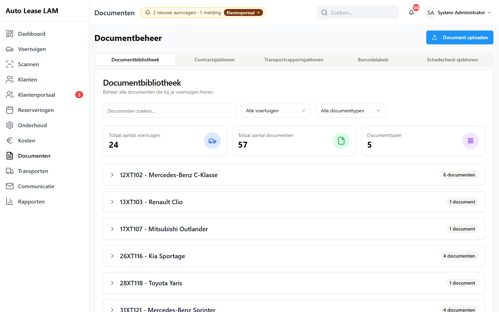

# 8. Documenten en afdrukken

In dit hoofdstuk staat welke documenten de app zelf maakt, waar ze vandaan komen, hoe je
ze bekijkt, afdrukt en downloadt, en wat er gebeurt als een reservering verandert nadat het
document al gemaakt is.

---

## 8.1 Welke documenten de app maakt

De app maakt vier soorten papier. Alles wat de app maakt is een PDF.

| Document | Waar het ontstaat | Waar het terechtkomt |
|---|---|---|
| **Huurcontract** | Bij het ophalen van een voertuig, en met de knop om het los te genereren | Documentbibliotheek, bij het voertuig en bij de reservering |
| **Schadecheck** | Bij het innemen, en vanuit het schadecheckscherm | Documentbibliotheek, bij het voertuig en bij de reservering |
| **Transportrapport** (transportbrief) | Vanuit het transportscherm, per transport of voor meerdere tegelijk | Documentbibliotheek; bij meerdere voertuigen onder **Algemene rapporten** |
| **Sleutellabels en barcodelabels** | Vanuit het voertuig of het labelscherm | Wordt direct afgedrukt, wordt **niet** bewaard in de documentbibliotheek |

Twee dingen die de app níét maakt:

- **Een getekend contract.** De app maakt alleen het onbetekende contract. Het exemplaar dat
  de klant heeft getekend, scan je in en zet je erbij met **Contract uploaden**.
- **Facturen.** De app genereert geen facturen. De factuurgegevens gebruik je in de rapporten.

---

## 8.2 Waar de gegevens vandaan komen

Een document wordt op het moment van genereren opgebouwd uit drie bronnen:

1. **De reservering** — periode, contractnummer, prijs, kilometerstanden, brandstofniveaus,
   afleveradres en de notities.
2. **Het voertuig en de klant** — kenteken, merk, model, chassisnummer, naam, adres, telefoon
   en rijbewijsnummer.
3. **Het sjabloon** — de achtergrond en de plek waar elk veld op de pagina komt te staan.

Daarom geldt: **een document is een momentopname.** Verandert er daarna iets aan de
reservering, dan verandert het document niet mee. Zie paragraaf 8.6.

Datums en bedragen op een gegenereerd document staan altijd in het Nederlands en in de
Nederlandse notatie: `13-09-2026` of `13 september 2026`, en `€ 1.234,50`. Dat geldt ook als
de klant het portaal in het Engels gebruikt. Heeft een huur geen einddatum, dan staat er
**nader te bepalen** op het contract.

---

## 8.3 Waar je documenten terugvindt

Er zijn drie plekken, met dezelfde documenten erin.

*Het scherm **Documentbeheer**: rechtsboven **Document uploaden**, daaronder de tabbladen
**Documentbibliotheek**, **Contractsjablonen**, **Transportrapportsjablonen**, **Barcodelabels**
en **Schadecheck-sjablonen**.*

**Documenten → Documentbibliotheek**
Het volledige overzicht, gegroepeerd per voertuig. Bovenaan zie je het aantal voertuigen, het
aantal documenten en het aantal documenttypen. Je filtert met **Alle voertuigen** en
**Alle documenttypen**, of je zoekt op bestandsnaam. Staat er niets: *"Geen documenten gevonden
die overeenkomen met je filters."*

**Bij het voertuig**
Open het voertuig en ga naar het tabblad **Documenten**. Je ziet alleen wat bij deze auto hoort.

**Bij de reservering**
Open de reservering en klik op de knop om documenten te openen. Je krijgt het venster
**Reserveringsdocumenten** — *"Documenten specifiek gekoppeld aan deze reservering (contracten,
schaderapporten, foto's)"*. Dit is de plek waar je ook ziet of een document gemaild is.

> **Let op:** de kopjes boven de groepen in dit venster zijn nog de interne namen van de app:
> `Contract (Unsigned)`, `Damage Check (Pickup)`, `transport_report`. Dat is dezelfde lijst als
> in de documentbibliotheek en er staat niets anders in dan je verwacht — alleen de
> benaming is niet vertaald.

---

## 8.4 Genereren, bekijken, afdrukken, downloaden

### Genereren

Meestal hoef je niets te doen: het contract wordt gemaakt op het moment dat je het ophalen
afrondt met **Ophalen voltooien & contract genereren**, en de schadecheck bij
**Inleveren voltooien & schadecheck genereren**.

Direct daarna verschijnt een venster met de uitslag:

- **Contract klaar** — *"&lt;bestandsnaam&gt; is aangemaakt. Print het of mail het direct naar de
  klant."* Met de knoppen **Afdrukken** en **Mail naar klant**.
- **Contract kon niet gemaakt worden** — *"De handeling is vastgelegd, maar het document is niet
  aangemaakt. Probeer het opnieuw of controleer de sjablonen."* Met de knop
  **Opnieuw proberen**.

Het ophalen zelf is in beide gevallen wél verwerkt. Een mislukt contract betekent niet dat de
auto niet is meegegeven; het betekent alleen dat er geen PDF is. Klik op **Opnieuw proberen**,
of maak het contract later alsnog vanuit de reservering.

> Bij een mislukte **schadecheck** staat er geen knop **Opnieuw proberen**. Maak de schadecheck
> dan opnieuw vanuit het schadecheckscherm.

### Bekijken, downloaden, afdrukken, e-mailen, verwijderen

In de documentbibliotheek heeft elk document dezelfde vijf knoppen:

| Knop | Wat het doet |
|---|---|
| **Bekijken** | Opent het PDF in een voorvertoning |
| **Downloaden** | Slaat het bestand op je computer op |
| **Afdrukken** | Opent het afdrukvenster van je browser |
| **E-mailen** | Opent het venster om het document naar de klant te sturen (hoofdstuk 9) |
| **Verwijderen** | Haalt het document weg |

Bij afdrukken meldt de app *"Afdrukken gestart — Het afdrukvenster zou nu open moeten zijn.
De pop-up sluit automatisch."* Lukt dat niet, dan krijg je een van deze twee meldingen:

- *"Je browser heeft afdrukken geblokkeerd. Gebruik de downloadknop en druk handmatig af."*
- *"Sta pop-ups toe en probeer het opnieuw, of gebruik de downloadknop."*

Beide zijn een browserinstelling, geen fout in de app. Downloaden en daarna afdrukken werkt
altijd.

---

## 8.5 Sjablonen: wie ze beheert en wat er mis kan gaan

De sjablonen bepalen hoe een document eruitziet. Ze staan onder **Documenten**, in vier
tabbladen naast de bibliotheek:

| Tabblad | Waarvoor | Wie mag het wijzigen |
|---|---|---|
| **Contractsjablonen** | Het huurcontract | Recht **PDF-sjablonen beheren** |
| **Transportrapportsjablonen** | De transportbrief | Recht **PDF-sjablonen beheren** |
| **Barcodelabels** | Sleutel- en voertuiglabels | Bekijken mag iedereen; wijzigen vraagt **PDF-sjablonen beheren** |
| **Schadecheck-sjablonen** | Het schadecheckformulier en de voertuigdiagrammen | Recht **Schadecontroles beheren** |

Een contractsjabloon open je via **Sjablooneditor openen**. In de editor sleep je velden op de
achtergrond. Eén sjabloon is de standaard; die herken je aan het label **Standaard**, en je
stelt hem in met **Als standaard instellen**.

**Dit is de belangrijkste regel over sjablonen:** een sjabloon zonder velden levert een blanco
contract op, en daarom weigert de app het. De melding is:

> *The PDF template "&lt;naam&gt;" has no fields, so the contract would be completely blank. Open it
> in the template editor, place the fields, and try again.*

Krijg je die melding, dan is er niets mis met de reservering. Er is een leeg sjabloon
geselecteerd. Kies een ander sjabloon, of laat een collega met het recht **PDF-sjablonen
beheren** de velden in het sjabloon plaatsen.

Twee andere meldingen uit dezelfde hoek:

- *Template not found* — het gekozen sjabloon bestaat niet meer. Kies een ander sjabloon.
- *No contract template has been configured. Create one under Settings → PDF templates before
  generating a contract.* — er is helemaal geen contractsjabloon. Er moet er eerst één gemaakt
  worden. Die melding wijst naar "Settings"; in de app vind je de sjablonen onder **Documenten →
  Contractsjablonen**.

Staat er geen sjabloon als standaard ingesteld, dan pakt de app zelf het eerste sjabloon uit de
lijst. Dat kan een verkeerd sjabloon zijn. Zorg dus dat er altijd bewust één sjabloon op
**Standaard** staat.

---

## 8.6 Versies en de markering "Verouderd"

Een document dat de app maakt, krijgt een **versienummer**. De eerste is versie 1. Elke nieuwe
versie van hetzelfde soort document bij dezelfde reservering krijgt het volgende nummer.

### Wanneer iets "verouderd" wordt

Een document krijgt de markering **Verouderd** in twee gevallen:

1. **De reservering is gewijzigd nadat het document gemaakt was.** Dat geldt voor de dingen die
   op het contract staan: het voertuig, de klant, de chauffeur, de datums, de prijs, het
   contractnummer, de kilometerstanden, de brandstofniveaus, de werkelijke ophaal- en
   innamedatum, het afleveradres en de notities. De reden die erbij staat is
   *"the reservation changed after this document was generated"*.
2. **Er is een nieuwere versie gemaakt.** De vorige versie krijgt dan de reden
   *"superseded by a newer version"*.

Je herkent het aan een oranje label bij het document:

> ⚠ **Verouderd** · versie 1

Ga je er met de muis overheen, dan staat er: *"Dit document is gemaakt vóór een wijziging aan de
reservering en klopt mogelijk niet meer."*

**Het oude document blijft altijd bewaard.** De app gooit nooit uit zichzelf een contract weg en
vervangt het ook niet stilletjes. Wat er ooit is afgedrukt of gemaild, blijft terug te vinden.

### Bewust een nieuwe versie maken

Naast een verouderd document staat de knop **Opnieuw genereren**. Die maakt een nieuwe versie
met de gegevens zoals ze nu zijn. Tijdens het maken staat er *"Bezig met genereren…"*, daarna
krijg je de melding:

> **Nieuwe versie aangemaakt** — *"Versie 2 van &lt;bestandsnaam&gt; staat nu in het dossier. De oude
> versie blijft bewaard."*

De oude versie houdt zijn label **Verouderd**, de nieuwe versie is schoon. Lukt het niet, dan
staat er **Opnieuw genereren is niet gelukt** met de reden erbij.

De knop **Opnieuw genereren** staat op twee plekken: in de **Documentbibliotheek** en in het
venster **Reserveringsdocumenten**.

### Waar de knop niet staat

**Opnieuw genereren** verschijnt alleen bij documenten die de app zelf kan namaken: het
huurcontract en de schadecheck die bij een reservering horen. Bij een geüpload document, bij een
transportrapport en bij een document zonder reservering staat de knop er niet — er is dan niets
om het opnieuw uit op te bouwen.

### Wat je zelf moet doen

De markering is een signaal, geen automatische correctie. Wat je moet doen:

1. Je ziet **Verouderd** staan bij een contract.
2. Controleer of de klant het oude contract al heeft. Zo ja, spreek af wat er met dat exemplaar
   gebeurt.
3. Klik op **Opnieuw genereren**.
4. Print of mail de nieuwe versie.

Doe je dit niet, dan blijft het oude contract gewoon bestaan en klopt het niet meer met de
reservering. De app waarschuwt daar verder niet over.

---

## 8.7 De twee documentrechten

Documenten hebben een eigen recht, los van het recht op voertuigen en reserveringen. In het
beheerscherm staan twee vinkjes:

| Vinkje | Wat het toestaat |
|---|---|
| **Documenten bekijken** | De lijst zien, een document openen, downloaden en afdrukken, en de contractgegevens inzien |
| **Documenten bewerken en genereren** | Alles hierboven, plus: een contract of schadecheck genereren, opnieuw genereren, uploaden, mailen en verwijderen |

Dat onderscheid is er met opzet. In een contract staan het adres, het telefoonnummer en het
rijbewijsnummer van de klant. Wie die gegevens niet nodig heeft, krijgt het vinkje
**Documenten bekijken** niet.

Heb je het recht niet, dan geeft de app een melding als:

> *Not authorized. One of these permissions required: view_documents, manage_documents*

of, voor genereren:

> *Not authorized. One of these permissions required: manage_documents*

Dat is geen storing. Vraag een beheerder om het vinkje aan te zetten (hoofdstuk 10).

> **Let op:** een beheerder mag altijd alles. De vinkjes hebben op een beheerdersaccount geen
> beperkende werking.

---

## 8.8 Kort samengevat

- Contract bij ophalen, schadecheck bij innemen — allebei automatisch.
- Alles staat in **Documenten → Documentbibliotheek**, en ook bij het voertuig en bij de
  reservering.
- **Bekijken · Downloaden · Afdrukken · E-mailen · Verwijderen** staan bij elk document.
- Verandert de reservering, dan krijgt het document het label **Verouderd**. Jij beslist wanneer
  er een nieuwe versie komt, met **Opnieuw genereren**.
- Het oude document verdwijnt nooit.
- Een sjabloon zonder velden wordt geweigerd; dat is de app die een blanco contract tegenhoudt.
