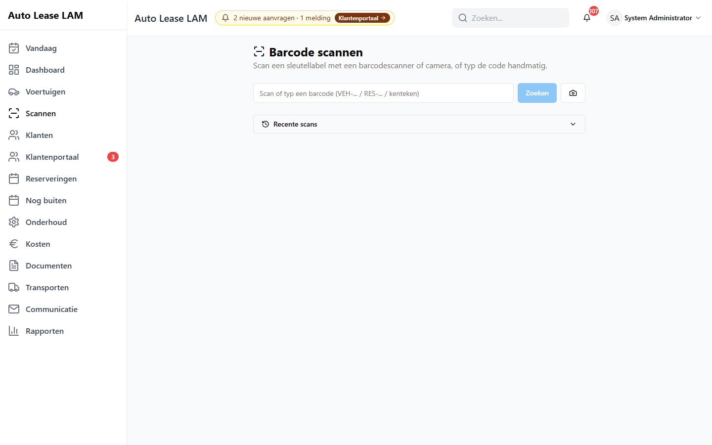

# 18. Barcode en scannen

Aan elke sleutelbos hangt een label met een barcode. Scan je dat label, dan zit je in één
handeling op de juiste auto — en kun je vanaf datzelfde scherm meteen doorwerken: ophalen,
innemen, kosten boeken, tanken, de kilometerstand bijwerken.

Scannen is niet alleen sneller dan zoeken, het is ook veiliger. Je kunt met een scan niet de
verkeerde auto pakken. Twee Volkswagens Golf van hetzelfde bouwjaar zien er in een lijst
hetzelfde uit; hun labels niet.

---

## 18.1 Het scanscherm openen

Er zijn drie manieren:

- Klik links in het menu op **Scannen**.
- Druk op de toets `S`. Dat werkt overal, behalve terwijl je in een invoerveld typt.
- Klik op het **Dashboard** onder **Snelle acties** op **Scannen**.

Je komt op **Barcode scannen** — *Scan een sleutellabel met een barcodescanner of camera, of typ
de code handmatig.*

Op het scherm staan een invoerveld, de knop **Zoeken**, een cameraknopje en onderaan het blok
**Recente scans**.

**Met een USB-scanner.** Een barcodescanner gedraagt zich als een toetsenbord: hij typt de code
en drukt zelf op Enter. Zorg dat de cursor in het invoerveld staat (klik er één keer in) en scan.
Je hoeft verder niets te doen.

**Met de hand.** Typ de code of het kenteken en klik op **Zoeken** of druk op Enter. Tijdens het
zoeken staat er *Bezig met zoeken...*

**Met de camera.** Klik op het cameraknopje. Zie 18.6.

> **Waarom de losse letters `N`, `S` en `?` niet werken terwijl je in het scanveld staat:** een
> scanner typt letters als een toetsenbord. Zou de app op die letters reageren, dan opende elke
> scan met een S erin een ander venster. Dat is met opzet uitgezet.

---

## 18.2 Wat je kunt scannen

| Code | Wat het is |
|---|---|
| **VEH-000123** | Het sleutellabel van een voertuig |
| **VEH-000123-S** | Het label van de **reservesleutel** van datzelfde voertuig |
| **VEH-000123-R2** | Een opnieuw aangemaakt label (na *Barcode opnieuw genereren*) |
| **RES-003366** | De code van een reservering |
| Een **kenteken** | Werkt ook: typ of scan gewoon `HL-02-HL` |

Hoofdletters, kleine letters en spaties maken niet uit; de app maakt er zelf hoofdletters van.

Wordt er niets gevonden, dan staat er: *Geen voertuig of reservering gevonden voor "ZZ-00-ZZ"*.
Controleer dan het label of typ het kenteken. Bij een storing krijg je *Opzoeken mislukt.
Controleer de verbinding en probeer opnieuw.*

---

## 18.3 Wat je te zien krijgt na een scan

### Bij een voertuig

Bovenaan het resultaat staan het merk en model, een statuslabel en het kenteken met de barcode
eronder. De statuslabels zijn hier dezelfde als in de voertuigenlijst: **Beschikbaar**,
**Gepland**, **Verhuurd**, **Reparatie nodig** en **Niet voor verhuur**.

Scande je het reservesleutel-label, dan staat er het extra label **Reservesleutel** bij. Zo weet
je zeker welke sleutel je in handen hebt.

Daaronder een rijtje gegevens: **APK-vervaldatum**, **Garantie tot**, **Kilometerstand**,
**Brandstof** en **Registratie**. Wat niet bekend is, toont **N.v.t.**

Daaronder volgen, als ze er zijn, drie blokken:

- **Actieve reservering** of **Aankomende reservering** — met de klant, de status en de periode,
  plus de knop **Reservering openen**. Is er niets, dan staat er *Geen actieve of aankomende
  reservering*.
- **Onderhoud** (oranje) — met de werkplaatsstatus (**Onderhoud nodig** of **In onderhoud**) en
  de stand van het onderhoudsblok (**Gepland**, **In werkplaats** of **Voltooid**), plus de knop
  **Onderhoudsblok openen**.
- **Actief transport** — met de route en het label **Gepland** of **Onderweg**.

### Bij een reservering

Scande je een `RES-`-code, dan staat er **Reservering gevonden** met de auto, de klant, de status
en de periode, en de knoppen **Reservering openen** en **Voertuig openen**.

---

## 18.4 Wat je kunt doen zonder het scanscherm te verlaten

Onder het resultaat staan tegels met de acties die op dat moment zinvol zijn. Je ziet ze dus niet
allemaal tegelijk.

**Altijd zichtbaar:**

| Tegel | Wat er gebeurt |
|---|---|
| **Opnieuw scannen** | Het veld wordt leeggemaakt voor de volgende sleutel |
| **Voertuig openen** | De voertuigkaart opent |
| **Kosten registreren** | Een kostenregel op deze auto boeken (hoofdstuk 13, paragraaf 13.10) |
| **Document uploaden** | Een bestand aan deze auto hangen (hoofdstuk 8) |
| **Tanken** | Het venster **Brandstofstatus bijwerken** |
| **Km-stand bijwerken** | Het venster **Kilometerstand bijwerken** |

**Afhankelijk van de situatie:**

| Tegel | Verschijnt wanneer |
|---|---|
| **Ophalen starten** | Er is een reservering die nog niet is opgehaald, of er staat er een op stapel |
| **Inleveren starten** | De lopende reservering staat op **Opgehaald** |
| **Reservering maken** | Er is geen enkele lopende of aankomende reservering |
| **Onderhoud inplannen** | De auto staat niet in de werkplaats |
| **Terug uit onderhoud** | De auto staat wél in de werkplaats |
| **Transport starten** | Er ligt een transport op **Gepland** |
| **Transport afronden** | Het transport staat op **Bezig** |

Van **Ophalen starten** en **Inleveren starten** zie je er altijd maar één; welke, hangt af van
de stand van de huur. Is er helemaal geen reservering, dan zie je ze geen van beide.

Van **Onderhoud inplannen** en **Terug uit onderhoud** geldt hetzelfde: ze sluiten elkaar uit.

Wat elke tegel doet:

- **Ophalen starten** opent het venster **Ophaalproces starten**. Zie hoofdstuk 5, paragraaf 5.7.
- **Inleveren starten** opent **Inleverproces starten**. Zie hoofdstuk 5, paragraaf 5.8.
- **Onderhoud inplannen** opent het venster **Onderhoud plannen** met deze auto al ingevuld. Zie
  hoofdstuk 7, paragraaf 7.2.
- **Terug uit onderhoud** zet de werkplaatsstatus meteen om, zonder tussenvenster. Je krijgt
  **Voertuig is terug uit onderhoud**.
  > De knop sluit alleen het onderhoudsblok af dat vandaag loopt; onderhoud dat verderop in de
  > kalender staat blijft gewoon staan. De **Beschikbaarheidsstatus** komt meteen in een
  > verhuurbare staat, dus je hoeft niets meer met de hand terug te zetten. Zie hoofdstuk 7,
  > paragraaf 7.5.
- **Transport starten** zet het transport op **Onderweg**; je krijgt **Transport gestart**. De
  knop heet daarna **Transport afronden**; die zet hem op voltooid met de melding **Transport
  afgerond**. Zie hoofdstuk 6, paragraaf 6.5.

Gaat er iets mis, dan meldt de app **Onderhoudsstatus wijzigen mislukt** of **Transportstatus
wijzigen mislukt**.

---

## 18.5 Recente scans

Onderaan het scherm staat het blok **Recente scans**. Per regel zie je het tijdstip, de gescande
code, het kenteken dat erbij hoort en wie er gescand heeft. Vond de app niets, dan staat er
**geen match**.

Handig als je net iets in handen had en niet meer weet welk kenteken het was, en om te zien of
een collega die sleutel al langs heeft gehad. Staat er niets, dan lees je *Nog geen scans*.

---

## 18.6 Scannen met de camera

Klik op het cameraknopje naast het invoerveld. Je krijgt **Camera scannen** — *Richt de camera op
de barcode van het sleutellabel.* Houd de barcode rustig in beeld; zodra hij gelezen is, gaat het
venster dicht en staat het resultaat op het scherm. Met **Sluiten** stop je.

**Camera scannen werkt alleen via een beveiligde verbinding (https).** Opent de app via gewoon
`http`, dan blokkeert de browser de camera en krijg je de melding:

> *De browser blokkeert de camera omdat de app via onbeveiligd HTTP wordt geopend. Camera scannen
> werkt alleen via HTTPS of op localhost. Open de app via https:// of gebruik het invoerveld met
> een USB-scanner.*

Andere meldingen die je kunt zien: *Cameratoegang geweigerd. Sta cameragebruik toe in de
browserinstellingen of gebruik het invoerveld.*, *Geen camera gevonden op dit apparaat.* en
*Camera starten mislukt.*

Aan de balie is de USB-scanner in de praktijk sneller en betrouwbaarder. Gebruik de camera vooral
op een tablet of telefoon op het terrein.

---

## 18.7 Scannen vanuit het dashboard

Op het **Dashboard**, onder **Snelle acties**, staan drie tegels die het scanvenster gebruiken
als opstapje:

- **Ophalen starten** — je krijgt het venster **Ophalen starten** met de tekst *Scan het
  sleutellabel of typ het kenteken. De juiste handeling wordt meteen geopend.* Na de scan opent
  het ophaalvenster direct.
- **Innemen starten** — hetzelfde, maar dan voor het innemen.
- **Schadecheck starten** — *Scan de barcode van het voertuig. Bij een opgehaald voertuig start
  de retourcheck, anders de ophaalcheck.* Je kunt ook op **Doorgaan zonder scan** klikken.

De knop op het dashboard heet **Innemen starten**, terwijl de tegel op het scanscherm zelf
**Inleveren starten** heet. Het is hetzelfde venster.

---

## 18.8 De sleutelkast-audit

Eén keer per periode loop je de sleutelkast na: hangt er nog wat er hoort te hangen? De app helpt
je daarbij door bij te houden welke sleutels je gescand hebt en welke ontbreken.

1. Klik links op **Voertuigen**.
2. Klik rechtsboven op **Sleutelkast-audit**. Je krijgt het venster **Sleutelkast-audit** —
   *Scan alle sleutels in de kast; daarna zie je welke ontbreken.*
3. Onder het invoerveld staat de teller: *0 van 305 verwachte sleutels gescand*. Dat getal is het
   aantal sleutels dat volgens de app in de kast hoort te hangen.
4. Scan nu één voor één alle sleutels in de kast. De teller loopt mee.
5. Ben je door de kast heen, klik dan op **Audit afronden**.
6. Je krijgt de uitslag te zien:
   - **Ontbrekende sleutels** — de auto's waarvan je het label niet hebt gescand, met kenteken,
     merk en model. Dit is de lijst waar je mee aan de slag moet.
   - **Onverwacht aanwezig (voertuig staat als verhuurd)** — sleutels die je wél gescand hebt,
     terwijl de auto volgens de app bij een klant staat. Dat betekent dat de auto terug is en de
     huur nooit is afgesloten; kijk dan op **Nog buiten** (hoofdstuk 5, paragraaf 5.11).
   - Is alles compleet, dan staat er: *Geen sleutels ontbreken 🎉*
7. Met **Opnieuw beginnen** wis je de telling en begin je opnieuw. Met **Sluiten** ga je weg.

**Meldingen tijdens het scannen:**

| Melding | Betekenis |
|---|---|
| *Al gescand* | Deze sleutel had je al gehad |
| *Onbekende code: <code>* | Het label hoort bij geen enkel voertuig |
| *Dit is een reserveringscode, geen voertuigsleutel* | Je scande een `RES-`-code |
| *Dit is een hoofdsleutel. Scan het reservesleutel-label (-S).* | Verkeerde kast |
| *Dit is een reservesleutel. Gebruik hiervoor de reservesleutelkast-audit.* | Verkeerde kast |

### De reservesleutelkast

Voor de reservesleutels is er een eigen knop: **Reservesleutelkast-audit** — *Scan alle
reservesleutels in de kast; daarna zie je welke ontbreken.* Hij werkt precies hetzelfde. De
teller telt de reservesleutels, en het tweede resultatenblok heet hier **Onverwacht aanwezig
(staat als bij klant of zonder reservesleutel)**.

Hangt een reservesleutel bij de klant, dan zet je dat op de voertuigkaart: **Bewerken** →
tabblad **Technisch** → **Reservesleutel bij klant** met de **Klantnaam**. Dan weet de audit dat
die sleutel terecht niet in de kast hangt.

> **Twee dingen om te weten.** De uitslag van de audit wordt **niet bewaard**: sluit je het
> venster, dan is de lijst weg. Er is ook geen knop om hem af te drukken of te exporteren.
> Schrijf de ontbrekende kentekens dus over, of handel ze meteen af. Wat wél bewaard blijft, is
> elke scan afzonderlijk: die komt in **Recente scans** te staan, met jouw naam erbij.

---

## 18.9 Labels afdrukken

### Eén label

1. Open de auto met **Bekijken**.
2. Klik op **Barcode bekijken**. Het venster **Voertuigbarcode** opent.
3. Kies bij **Labelsjabloon** de indeling die bij jullie labelprinter hoort — *Kies het
   labelsjabloon voor deze afdruk.*
4. Klik op **Sleutellabel afdrukken** of op **Reservesleutel-label afdrukken**.

Op de voertuigkaart staan bovenin ook de knoppen **Sleutellabel** en **Reservesleutel-label**,
direct naast de barcode. Die doen hetzelfde: ze vragen eerst om het **Labelsjabloon** en dan
klik je op **Afdrukken**.

### Een nieuw label voor een auto

Is het label onleesbaar of kwijt, dan kun je een nieuwe code laten maken met **Barcode opnieuw
genereren**. De app waarschuwt eerst:

> **Barcode opnieuw genereren?**
> *De oude barcode (<code>) werkt daarna niet meer. Reeds afgedrukte labels moeten opnieuw worden
> afgedrukt. Deze actie kan niet ongedaan worden gemaakt.*

Doe dit alleen als het echt nodig is: het oude label in de kast of in het barcodeboek werkt
daarna niet meer. Na afloop krijg je **Nieuwe barcode: <code>**. Druk meteen een nieuw label af.

### Alle labels tegelijk

1. Klik op **Voertuigen** → **Barcodeboek**. Je krijgt **Barcodeboek** — *Druk alle
   voertuigbarcodes af voor in een map of klapper.*
2. Kies een **Labelsjabloon**.
3. Filter eventueel met het zoekveld *Zoeken op kenteken, merk of model...* of met het
   statuslijstje **Alle statussen**.
4. Selecteer wat je wilt met **Alles selecteren** of door regels aan te vinken; **Selectie
   wissen** maakt de selectie leeg. Boven de lijst staat *… geselecteerd*.
5. Klik op de afdrukknop. Die heet **Selectie afdrukken** als je regels hebt aangevinkt,
   **Gefilterde afdrukken (…)** als er een filter aanstaat, en anders **Alles afdrukken (…)**.
   Met **Stickers afdrukken** krijg je de sleutellabels in stickervorm.

De afgedrukte pagina heeft bovenaan de kop *Barcodeboek — Auto Lease LAM*.

**Drukt de browser niets af?** Dan blokkeert hij het pop-upvenster. Je krijgt dan de melding
*Je browser heeft afdrukken geblokkeerd. Gebruik de downloadknop en druk handmatig af.* Sta
pop-ups toe voor deze site en probeer het opnieuw.

---

## 18.10 Snel naslaan

| Wat je wilt | Waar |
|---|---|
| Het scanscherm openen | `S`, of **Scannen** in het menu |
| Een auto opzoeken met de sleutel | Scan `VEH-…` of typ het kenteken |
| Een reservering opzoeken | Scan of typ `RES-…` |
| Meteen ophalen of innemen | Scannen → **Ophalen starten** / **Inleveren starten** |
| Een transport starten of afronden | Scannen → **Transport starten** / **Transport afronden** |
| Een auto uit de werkplaats halen | Scannen → **Terug uit onderhoud** |
| Zien wat je net gescand hebt | **Recente scans** |
| De sleutelkast nalopen | **Voertuigen** → **Sleutelkast-audit** |
| De reservesleutels nalopen | **Voertuigen** → **Reservesleutelkast-audit** |
| Eén label afdrukken | Voertuigkaart → **Barcode bekijken** → **Sleutellabel afdrukken** |
| Alle labels afdrukken | **Voertuigen** → **Barcodeboek** |
